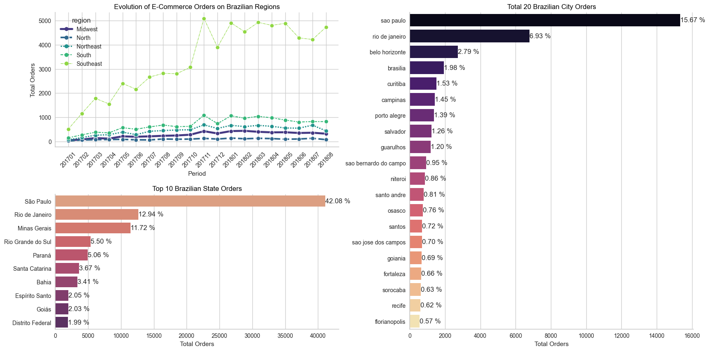

# Brazilian E-Commerce Public Dataset by Olist
This Documentation presented by Gamma Team:

Mario Billy Gunawan  
Muhammad Reyhan  
Muhamad Rafif  
## Business Understanding  
### Introduction  
Olist, a Brazilian e-commerce marketplace integrator, is an online e-commerce site aggregation platform designed to facilitate direct sales on e-commerce sites of Brazil. The company's platform connects entrepreneurs with major online retailers and allows shopkeepers to advertise and sell in the marketplaces without complication, enabling retail companies to reach out to the international marketplaces, improve the shopping experience and modify their purchasing behavior. Olist connects small businesses from all over Brazil to channels without hassle and with a single contract. Those merchants are able to sell their products through the Olist Store and ship them directly to the customers using Olist logistics partners. After a customer purchases the product from Olist Store a seller gets notified to fulfill that order. Once the customer receives the product, or the estimated delivery date is due, the customer gets a satisfaction survey by email where he can give a note for the purchase experience and write down some comments.  

### Context
The dataset has information of 100k orders from 2016 to 2018 made at multiple marketplaces in Brazil. Its features allows viewing an order from multiple dimensions: from order status, price, payment and freight performance to customer location, product attributes and finally reviews written by customers.The geolocation dataset that relates Brazilian zip codes to lat/lng coordinates.  

### Problem Statements
Olist have collected data throughout the year, the data contains seperated information, there are aggregated data, unique data or even combination of both (Aggregated on a unique data). With olist current dataset, it is hard to identify customer behaviour, since it has no representation of customer segments, moreover, even after understanding with segmentation what kind of approach should they take? hence... The questions to be answered in this project:

1. Is there any growing trend on e-commerce sales in Brazil?  
2. How the total sales is concentraded in brazilian states?  
3. What are the best states to do transaction in Brazil?  
4. How payments types can take influence on e-commerce?  
5. How are the behaviour of our customer?  
6. How would you classify them?  
7. How CRM campaign strategy be implemented?  

### Objective
With this project, it is hoped that Olist will be able to classify their customers with the appropriate segmentation.

### Project Limitation
The machine learning model built is limited to orders from 2016 to 2018 made at multiple marketplaces in Brazil from the Brazilian E-Commerce Public Dataset by Olist. So the performance of the model will be much different when used to classify customers from today. #In addition, this model is built from several selected features based on features importance and correlation analysis to the target.

### Analytical Approach
Underlying the problem statements, Our main focus lies around the implementation of CRM Campaign, the analytical approach we use are:

1. Customer Segmentation by Clustering  
2. Classification of Clusters  

### Evaluation Metrics
Since dealing with multi-class classification, False Classes are equally important, hence F1-Score would be an appropriate metrics for this.  

## Data Understanding  
  
Dataset Resource: https://www.kaggle.com/datasets/olistbr/brazilian-ecommerce?select=olist_order_items_dataset.csv

Features Description:

- order_id : unique identifier of the order.
- order_item_id : sequential number identifying number of items included in the same order.
- product_id : product unique identifier.
- seller_id : seller unique identifier.
- shipping_limit_date : Shows the seller shipping limit date for handling the order over to the logistic partner.
- price : item price.
- freight_value : item freight value item (if an order has more than one item the freight value is splitted between items).
- customer_id : key to the orders dataset. Each order has a unique customer_id.
- order_status : Reference to the order status (delivered, shipped, etc).
- order_purchase_timestamp : Shows the purchase timestamp.
- order_approved_at : Shows the payment approval timestamp.
- order_delivered_carrier_date : Shows the order posting timestamp. When it was handled to the logistic partner.
- order_delivered_customer_date : Shows the actual order delivery date to the customer.
- order_estimated_delivery_date : Shows the estimated delivery date that was informed to customer at the purchase moment.
- payment_sequential : a customer may pay an order with more than one payment method. If he does so, a sequence will be created to accommodate all payments.
- payment_type : method of payment chosen by the customer.
- payment_installments : number of installments chosen by the customer.
- payment_value : transaction value.
- review_id : unique review identifier.
- review_score : Note ranging from 1 to 5 given by the customer on a satisfaction survey.
- review_comment_title : Comment title from the review left by the customer, in Portuguese.
- review_comment_message : Comment message from the review left by the customer, in Portuguese.
- review_creation_date : Shows the date in which the satisfaction survey was sent to the customer.
- review_answer_timestamp : Shows satisfaction survey answer timestamp.
- product_category_name : root category of product, in Portuguese.
- product_name_lenght : number of characters extracted from the product name.
- product_description_lenght : number of characters extracted from the product description.
- product_photos_qty : number of product published photos.
- product_weight_g : product weight measured in grams.
- product_length_cm : product length measured in centimeters.
- product_height_cm : product height measured in centimeters.
- product_width_cm : product width measured in centimeters.
- customer_unique_id : unique identifier of a customer.
- customer_zip_code_prefix : first five digits of customer zip code.
- customer_city : customer city name.
- customer_state : customer state initials.
- geolocation_lat_x : customer latitude.
- geolocation_lng_x : customer longitude.
- seller_zip_code_prefix : first five digits of seller zip code.
- seller_city : seller city name.
- seller_state : seller state initials.
- geolocation_lat_y : seller latitude.
- geolocation_lng_y : seller longitude.
- product_category_name_english : category name in English.

## Exploratory Data Analysis  

### Evolution of Total Orders in Brazilian E-Commerce
  
Insights:
- There is no record on November 2016 and incomplete records on September 2018. The Highest orders received in 1 month is on November 2017.
- Based on total orders by the day of week, Monday and Tuesday are the most transaction happened in a week with 16.29% and 16.05% from total.
- In total orders by time of the day, it can be seen that afternoon is the most transaction happened in a day with 38.29% from total. This may happen because more customers have free time during the lunch breaks. The second most is during night while customers have more free time after all day work.

### Total Orders Comparison Between 2017 and 2018 (January to August)
  
Insights:
- Based on Comparison plot above, it can be seen that there was an increase in orders of 136.52% between January and August in 2017 to January and August in 2018. This might happen because many new customers are transacting on Olist in 2018. Therefore, this case should be investigated further in modelling.

### Evolution of E-Commerce Orders on Brazilian Regions
  
Insights:
- Based on Evolution of E-Commerce Orders on Brazilian Regions plot, it can be seen that Brazil is divided into 5 major regions, where the South East is the region with the fastest evolution of e-commerce orders from January 2017 to August 2018. Meanwhile Sao Paulo and Rio de Janeiro from South East region are also in the 1st and 2nd place for top orders in each states and cities.

### Evolution of E-commerce: Total Orders and Total Amount Sold in R$
  
Insights:
- Highest value sold in history is on November 2017. It's possible that this can be happen when the blackfriday event is held, where each store probably gives a massive discount that only happens for 1 day. The value is 1001.9K just for 1 month.
- The total amount between January and August in 2017 to January and August in 2018 is also increased 137.04%. Where Evolution of Average Freight Value tend to be stable from January 2017 to May 2018. A sharp increase occurred in the July 2018. This might be happened because many new customer come to use Olist as their daily e-commerce to do shopping.

### Comparative Study: E-Commerce Delivery Performance
  
Insights:
- The mean value of freight paid is R$22.77. But, there are still many states that must paid more for freight value above R$40. The top 5 are Paraiba, Roraima, Rondonia, Acre, and Maranhao.
- Even Roraima State is also in top 2 of 5 states with highest average time to delivery. This needs to be discussed further between the Olist team, so the freight value can be adjusted and each customer gets the best delivery service at the right price.

### Evolution of Payment Types in Brazilian E-Commerce
  
Insights:
- Based on 3 plot above, it can be seen that credit card is the most preferred payment choice by customers with 73.99% from total. The evolution of payment types with credit card is also increasing rapidly from January 2017 to May 2018. Many customers also preffered to take 1 month payment installments. This indicates that payment with a credit card, customers do not need to immediately pay in full for the products they buy. They can pay it with installments they preffered and can be paid at the end of the periods.
- The most payment installments that customer preffered is 1. It indicates that many customers buy products that are not too expensive and are still able to be paid at the end of the first month.

## Clustering
  

### Based on the result of the clustering, we can conclude:

1. Class 2 : High Monetary & Low Recency
- Recent and high spending customer
- Still fresh with high trust to spend more
- This type of customer is the customer we want to retain it is our best customer

2. Class 0 : High Monetary & High Recency
- One of our old customer
- But have the trust to spend high
- Type of customer that goes through our e-commerce when they want to buy high value products

3. Class 3 : Low Monetary & Low Recency
- Fresh customers
- Spends not as much as class 0 and class 2
- Type of customer that loves shopping and buying small things

4. Class 1 : Low Monetary & High Recency
- Customers that are trying out our e-commerce
- Had a low spending
- The type of customer that tries our e-commerce and may end up not liking it

## Classification
  

From the findings, we can conclude that the cluster label is align with the explanation of SHAP values, those are:

1. Class 2 : High Monetary & Low Recency
- Recent and high spending customer
- Still fresh with high trust to spend more
- This type of customer is the customer we want to retain it is our best customer

2. Class 0 : High Monetary & High Recency
- One of our old customer
- But have the trust to spend high
- Type of customer that goes through our e-commerce when they want to buy high value products

3. Class 3 : Low Monetary & Low Recency
- Fresh customers
- Spends not as much as class 0 and class 2
- Type of customer that loves shopping and buying small things

4. Class 1 : Low Monetary & High Recency
- Customers that are trying out our e-commerce
- Had a low spending
- The type of customer that tries our e-commerce and may end up not liking it

## Conclusion & Actionable Recommendation

### Conclusion

- There is a growing trend on e-commerce sales in Brazil when the total amount sold between 2017 to 2018 is increased to 137.04%. The highest value sold in history was on November 2017 with 1001.9K just for 1 month. This could be happen because the blackfriday event is held on that month, where each sellers probably gives a massive discount that only happens for 1 day.

- The biggest mean price by customer state is Paraiba with R$215, but the amount price tend to be low with just R$113.40K. Inversely proportional to Sao Paulo where the mean price is lowest, but had the biggest amount price comparing to another states with R$5172.26K. This is how total sales is concentraded in Brazil.

- The Best states to do transaction in Brazil is Sao Paulo, where this state dominates the total orders of all Brazilian states by 42.8% from total.

- The credit card is the most preferred payment choice by customers with 73.99% from total. The evolution of payment types with credit card is also increasing rapidly from January 2017 to May 2018. Many customers also preffered to take 1 month payment installments. This indicates that payment with a credit card, many customers do not need to immediately pay in full for the products they bought. They can pay it with installments they preffered and can be paid at the end of the periods. Vouchers can also be used for payments, with this, customers can get discounts for the products that they bought and add more products to buy. This is how payment types can take influence on e-commerce.

- Based on the clusters, we conclude that it is divided by 4 groups of customer, which is:

1. Class 2 : The best customer, spend more on a recent timeline
2. Class 0 : Type of customer with trust on spending high value products, but may not choose this e-commerce on low spending
3. Class 3 : Type of customer that loves shopping for small things
4. Class 1 : Type of customer that are potentially high to churn

### Model Limitation
Model limitation is a condition where the model randomly predicted the observation and probably missclassify the truth labels. In this section, we try to find out the predictions that are probably missclasified by the model based on SHAP values by filtering the observations with insignificant SHAP values of total_price and total_freight values.

### Recommendation on model performance
1. Additional model that has not been used:
- For clustering: Agglomerative Hierarchy Clustering, DBscan, Gaussian Mixture Model, BIRCH
- For Classification: VotingClassifer, StackingClassifier, SVC, Naive Bayes, KNN

2. Improvement on dataset, more explainable features, such as demographic of customer.

3. More modelling or solution, such as Feature Sales (Time-Series Analysis), Customer Sentiment Analysis, Recommendation System

### Recommendation for the business problem
*Class 2: Best Customer*

Goal: Retain & if possible increase 
How ? 
- Giving promotion on all items include the lower or higher value products.
- Provide points and rewards to incentivize repeat purchases.

*Class 0: Old High-Value Customer:*

Goal: Draw Interest  
How ?
- Focus on building customer retention by giving discount on high value items.
- Provide excellent customer service and ensure a seamless shopping experience for their high-value transactions.
- On-time delivery guarantee, late delivery will result in a free shipment in the next purchase.
- Create an appealing and user-friendly experience for the customer. 
- Give a better shipping services, by live tracking of shipment. 

*Class 3: Fresh Shopper:*

Goal: Increase Spending  
How ? 
- Implement strategies to increase their average order value by offering bundle deals.
- Give a first-timer promotion like free shipping for a whole month. 
- Provide a detailed purchasing process which with easy to use shopping cart and multiple payment option. 
- Show product recommendation by previous purchase. 

*Class 1: Potential Churners:*

Goal: Draw Interest & Increase Spending  
How ? 
- Customer re-enggagement by giving an old user promotion to draw back to use the e-commerce.
- Collect feedback from these customers to understand their concerns or issues and address them promptly.

## Business Case
Assuming we have a business problem, where we needs to do marketing campaigns to increase the monetary value of customers and also reduce cost on doing campaigns and offerings, **assuming the case**:

1. we have a total of 750 Customers
2. about 250 new customers joined 
3. total revenue 500.000 dollar 
4. campaign budget 10% of revenue : 50.000 dollar ([Source](https://www.socialike.media/blog/ecommerce-marketing-budget-a-how-to-guide#:~:text=Know%20your%20business%20goals&text=Typically%2C%20a%20marketing%20budget%20for,12%25%20to%20fuel%20aggressive%20growth.))

> Without Model:

Without model, there will only be blind campaign, without knowing who to approach, or even how to approach. they will just ends up using all campaign budgets, or even more, so at the end:

- with the total of 1000 customers
- each customer gets a promotion on for about 50 dollars discount
- total budget used : 50.000 dollar and may spend more 

> With Model: 

With clustering, we can identify our customers based on segments, this way we can target campaign, and as an example that out of 1.000 customers 750 of them are the target market, but in this scenario we only came up until the segments and who to approach, moreover the clustering model used are only based on RFM, so they are very limited, so at the end:

- 750 customers are the only approached ones
- expected budget used: 37.500 dollar

and based on the classification the prediction of cluster are heavily determined by the delivery fee and also the price of the product

with that all 750 have different situation, where 250 of the customer have high spending with high delivery fee, and 500 of the customer have high spending and low on delivery cost, with this:

- the 250 customer still needs the full discount of 50 dollars
- the 500 customer doesn't need the full discount as they already have low delivery cost, which leads to a decrease of cost, and assuming that for delivery cost is 25, that means 500 customer only needs 25 dollars as a cost

So, in the end:

- 250 customer approached with full discount
- 750 customer approached with partial discount
- (250 x 50) + (500 x 25) = 12.500 + 12.500 = 25.000 Dollar

So by using the model company saved half of the marketing budget.

